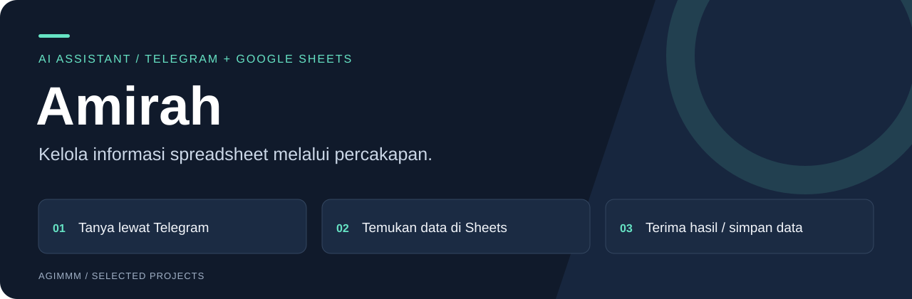
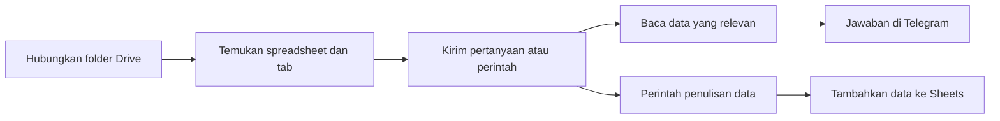
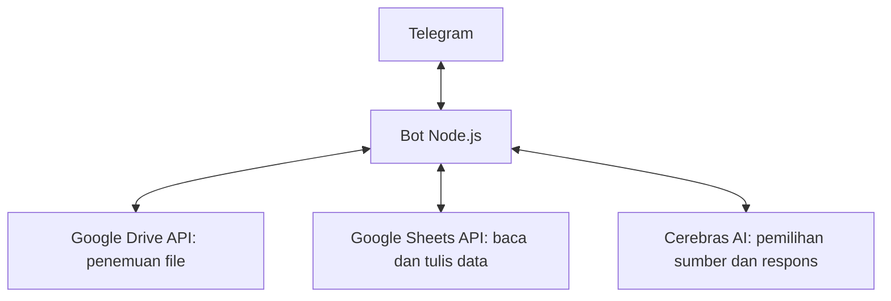

# Amirah — Asisten Google Sheets di Telegram

Amirah membantu pengguna mencari informasi, merangkum data, dan menambahkan data ke Google Sheets melalui percakapan Telegram.

**Node.js · Telegram Bot API · Google Sheets & Drive API · Cerebras AI**

[Alur penggunaan](#alur-penggunaan) · [Fitur](#fitur-utama) · [Panduan teknis](docs/SETUP.md) · [Portofolio pengembang](https://github.com/Agimmm)

## Mengapa Amirah?

Informasi operasional dapat tersebar di beberapa spreadsheet dan tab. Amirah menyediakan satu titik interaksi melalui Telegram: pengguna menghubungkan folder Drive, lalu meminta informasi dengan bahasa sehari-hari.

Google Sheets tetap menjadi tempat penyimpanan data. Bot menjadi antarmuka untuk membaca dan mengolah informasi, serta menulis data sesuai perintah.

## Alur penggunaan



## Fitur utama

| Kebutuhan pengguna | Implementasi |
| --- | --- |
| Menemukan sumber data | Pemindaian spreadsheet dalam folder Drive beserta tab dan header kolom. |
| Bertanya tanpa mencari tab satu per satu | Pemilihan sumber data yang relevan dan jawaban berbantuan AI. |
| Memasukkan data dari Telegram | Perintah `/input` untuk menambahkan baris ke spreadsheet dan tab tujuan. |
| Mengolah data antartab | Alur membaca sumber, mengolah informasi, dan menambahkan hasil ke tujuan. |
| Mengetahui data yang terhubung | Perintah `/sheets` menampilkan daftar spreadsheet dan tab pada sesi. |

## Contoh interaksi

Berikut contoh perintah, bukan transkrip hasil penggunaan:

```text
/start
/folder <tautan-folder-Google-Drive>
/sheets
Tampilkan rekap order bulan ini
/input Penjualan | Order | Produk Contoh | 2 | 150000
```

Nama spreadsheet, tab, dan urutan nilai mengikuti struktur data yang terhubung.

## Peran dan penggunaan nyata

**Peran saya: Full-stack Developer.**

Amirah digunakan oleh beberapa orang di Telkom Surabaya untuk membantu pemasukan data pelanggan dan pekerjaan terkait Google Sheets. Konteks tersebut menggambarkan penggunaan oleh individu; proyek ini tidak ditampilkan sebagai produk resmi atau bentuk dukungan dari Telkom.

Proyek telah selesai dikembangkan dan digunakan. Data pelanggan serta akses operasional tidak disertakan dalam dokumentasi publik.

## Arsitektur ringkas



## Peta kode

| Berkas | Fungsi |
| --- | --- |
| [telegram-bot.js](telegram-bot.js) | Entry point bot, sesi percakapan, integrasi Google, dan pemrosesan permintaan AI. |
| [package.json](package.json) | Dependensi dan perintah `npm start` untuk bot. |
| [index.html](index.html) | Antarmuka web Sheets AI yang juga disimpan di repo. |
| [server.js](server.js) | Server untuk antarmuka web dengan integrasi Groq; terpisah dari entry point bot Telegram. |

Konfigurasi bot dan antarmuka web dijelaskan di [panduan teknis](docs/SETUP.md).

---

Bagian dari [portofolio Amir Gymnastiar](https://github.com/Agimmm).
